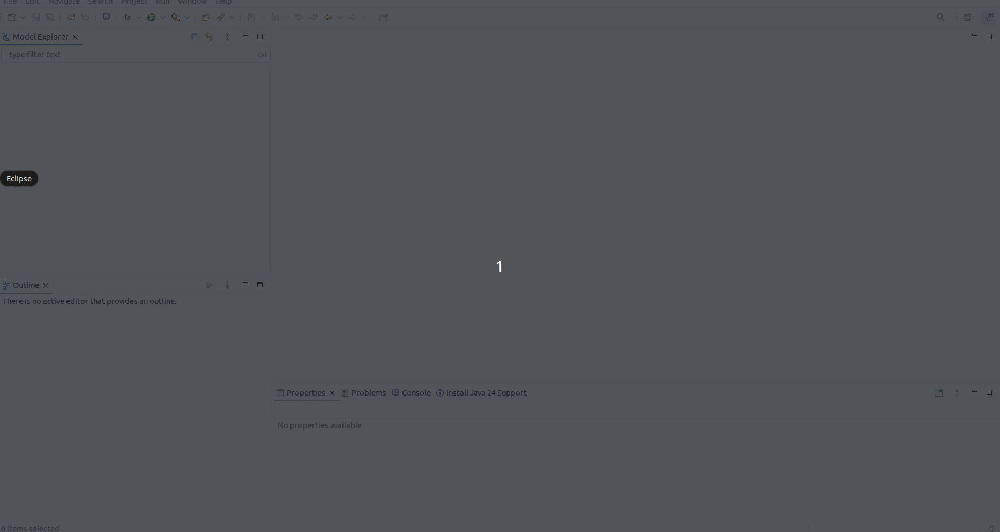
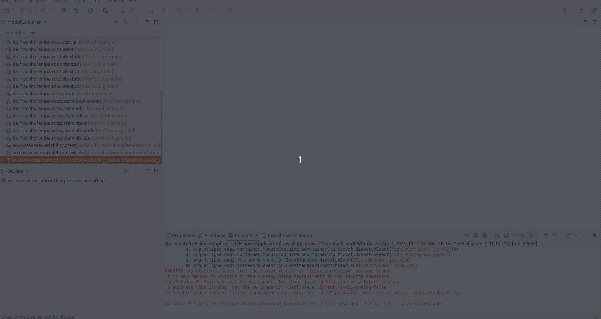

## Variability_ModelImplementation_Pilot 

This repository implements an example of a DSL (Domain Specific Language) implemented with Xtext and based on [RosTooling](https://github.com/ipa320/RosTooling) for the representation of variability in the form of parameters of a system in ROS 2.

### Installation

Please follow the instructions under [Option 1: Release](https://ipa320.github.io/RosTooling.github.io/docu/Installation.html#option-1-using-the-release-version-recommended) to install the RosTooling realese.

Clone the RosTooling source code and the pilot implementation from GitHub:

```
cd **EclipseWS**
git clone git@github.com:ipa320/RosTooling.git
git clone git@github.com:CoreSenseEU/Variability_ModelImplementation_Pilot.git
```

Then import the plugins into your workspace in eclipse. By selecting File->Import->Existing Projects into Workspace (General category). Under "Select root directory", press "Browse" and import all the project under plugins for both repositories.



Once all the projects are imported, go to the menu "Project"->"Clean" and enable "All projects" options. This command will build all the packages.

To start the application you can easily right click the project "eu.coresense.variability.xtext.ui" and select "Run as"->"Eclipse Application".




Then please follow the RosTooling instructions to import the base objects: [RosTooling setup](https://ipa320.github.io/RosTooling.github.io/docu/Environment_setup.html#1-switch-to-the-ros-developer-perspective).

You can import then, the exmaple from this repository.
